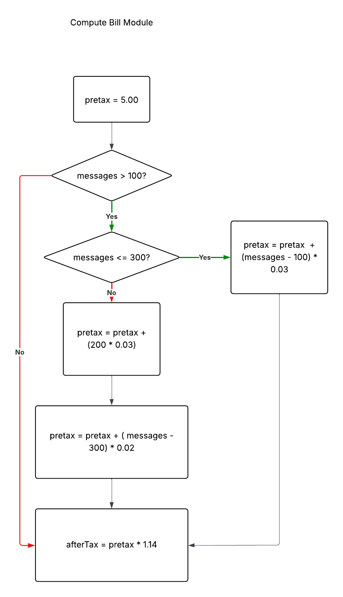
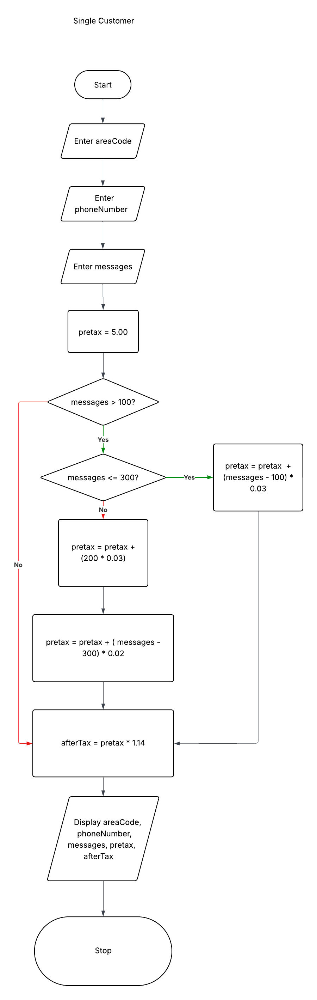
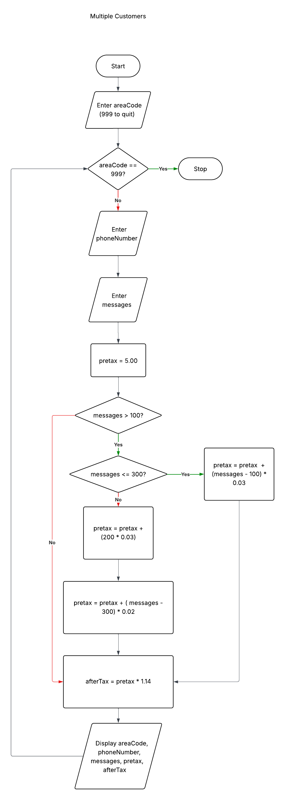
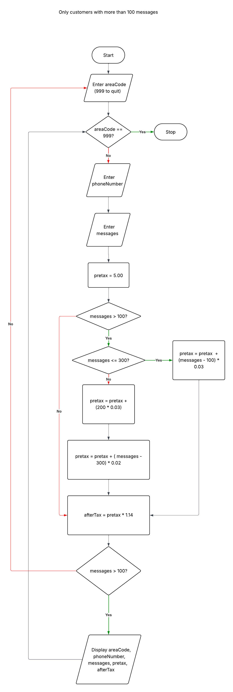
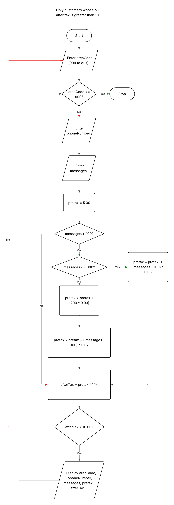
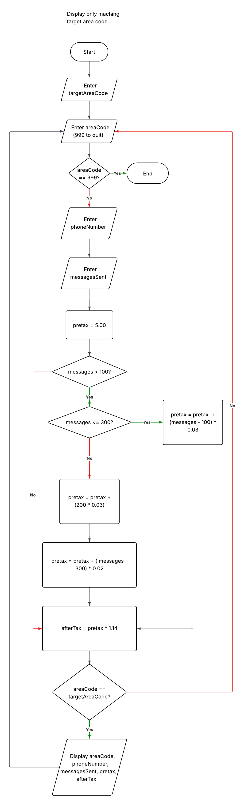

# Flowcharts — Dash Cell Billing System

This section contains flowcharts that model the logic and control flow for a mobile billing system.

Each diagram represents a different stage of system design, progressing from a reusable billing module to full multi-customer processing and conditional data filtering.

---

## 📊 Flowchart Overview

### 01 — Compute Bill Module
Core billing logic used across all workflows.

- Base charge: $5.00
- Message pricing:
  - First 100 messages included
  - 101–300: $0.03 per message
  - 301+: $0.02 per message
- Tax: 14%

---

### 02 — Single Customer Flow
Processes billing for a single customer.

- Inputs:
  - Area code
  - Phone number
  - Number of messages
- Outputs:
  - Pretax total
  - Final bill after tax

---

### 03 — Multiple Customers Flow
Processes multiple customers using a sentinel-controlled loop.

- Sentinel value: `999` (terminates input)
- Demonstrates:
  - Looping
  - Repeated data processing
  - Scalable system design

---

### 04 — Filter: Messages > 100
Displays only customers who exceed 100 messages.

- Demonstrates:
  - Conditional filtering
  - Post-processing decision logic

---

### 05 — Filter: Bill > $10
Displays only customers whose total bill exceeds $10 after tax.

- Demonstrates:
  - Output-based filtering
  - Threshold evaluation

---

### 06 — Filter: Target Area Code
Displays only customers matching a user-defined area code.

- Demonstrates:
  - User-driven filtering
  - Conditional matching logic

---

## 🧠 Key Concepts Demonstrated

- Modular design (reusable billing logic)
- Conditional logic (nested decision structures)
- Looping with sentinel values
- Data filtering and selection
- Structured input → process → output flow

---

## 🔗 Project Context

These flowcharts represent the **design layer** of the system.

They are supported by:
- Pseudocode (logic layer)
- Python implementation (execution layer)

This progression demonstrates a complete development workflow from concept to implementation.
